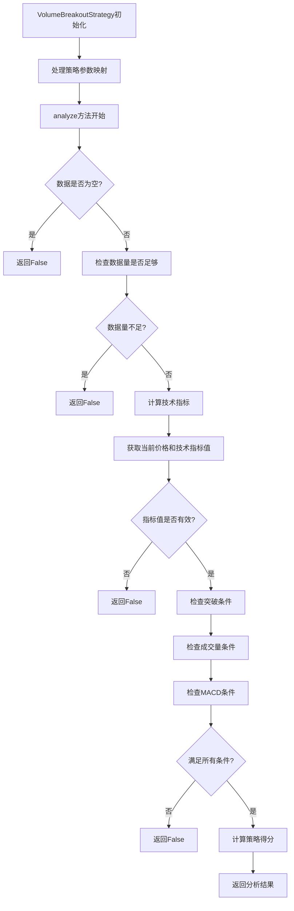

# Volume Breakout Strategy 分析文档

## 概述

本文档详细分析了Quant MAS系统中Volume Breakout Strategy（放量突破策略）的运行逻辑、流程以及各函数的功能。

## Volume Breakout Strategy 运行流程

该策略基于价格突破、成交量放大和动量确认三者共振的原理：
1. 计算前期高点（默认13周期）
2. 计算成交量移动平均（默认5周期）
3. 计算MACD指标（默认12,26,9周期）
4. 检查价格是否有效突破前期高点（考虑1.5%缓冲）
5. 检查成交量是否显著放大（默认1.8倍）
6. 检查MACD动量是否维持多头格局（DIF>0）
7. 综合评估突破强度并打分
8. 根据得分确定仓位大小



### Volume Breakout Strategy 主要函数功能总结

1. **`__init__`**: 初始化策略，处理参数映射（数据库参数名到策略参数名的转换）

2. **`analyze`**: 核心分析方法，判断股票是否符合放量突破策略
   - 检查数据有效性
   - 计算前期高点、成交量移动平均和MACD指标
   - 检查价格是否有效突破前期高点（考虑1.5%缓冲）
   - 检查成交量是否显著放大（默认1.8倍）
   - 检查MACD动量是否维持多头格局（DIF>0）
   - 综合评估突破强度并打分
   - 返回分析结果

3. **`get_technical_analysis_data`**: 获取技术分析数据供格式化使用
   - 计算前期高点、成交量移动平均和MACD指标
   - 返回包含价格、突破高点、成交量、量比和MACD值的字典

4. **`_calculate_score`**: 计算突破强度得分
   - 量能放大强度（40%权重）
   - 突破幅度强度（35%权重）
   - 动量确认强度（25%权重）

5. **`execute`**: 执行策略方法，处理多个股票的数据并保存结果到数据库

6. **`generate_signals`**: 生成交易信号，基于突破条件生成买入信号

7. **`calculate_position_size`**: 计算仓位大小，根据信号和投资组合价值确定持仓量

### Volume Breakout Strategy 返回值说明

`analyze`方法返回一个四元组(Tuple)，具体为：

```python
Tuple[bool, str, Optional[float], bool]
```

#### 返回值各元素说明

1. **第一个元素 (bool)**: `meets_criteria` - 是否满足选股条件
   - `True`表示股票符合放量突破策略的选股条件
   - `False`表示不符合条件

2. **第二个元素 (str)**: `selection_reason` - 选股原因/描述
   - 当满足条件时，返回类似"放量突破条件: 收盘价=XX.XX, 突破高点=XX.XX, 当前成交量=XXXX, 平均成交量=XXXX, 量比=X.XX, DIF=X.XXXX (满足放量突破)"的描述
   - 当不满足条件时，返回具体原因，如"突破强度不足，得分=XX.XX"或"数据不足，需要XX条数据"

3. **第三个元素 (Optional[float])**: `score` - 策略得分
   - 类型为可选的浮点数
   - 得分范围在0-100之间
   - 计算公式：
     ```
     score = max(
         0,
         min(
             100,
             40 * min(2.0, (volume_ratio - 1)) / 1.0  # 量能放大强度
           + 35 * (price - breakout_high) / breakout_high  # 突破幅度强度
           + 25 * max(0, macd_dif) / max(0.01, abs(macd_dif))  # 动量确认强度
         )
     )
     ```

4. **第四个元素 (bool)**: `breakout_signal` - 是否检测到有效突破信号
   - `True`表示检测到有效突破信号（价格突破、量能放大、MACD多头三者共振）
   - `False`表示未检测到有效突破信号

#### 代码中的具体返回语句

在满足条件的情况下：
```python
return True, reason, score, breakout_signal
```

在不满足条件的情况下：
```python
return False, reason, score, False
```

在出现异常的情况下：
```python
return False, f"分析错误: {e}", None, False
```

## 仓位管理规则

- score ≥ 80: position = 1.0 （满仓）
- 70 ≤ score < 80: position = 0.7 （7成仓）
- 60 ≤ score < 70: position = 0.4 （4成仓）
- score < 60: position = 0.0 （不参与）

## 风险控制

- 止损：跌破突破K线最低价立即止损
- 止盈：采用移动止盈，最高点回撤5%止盈一半，回撤8%全部清仓
- 单只个股最大仓位不超过25%

## 核心逻辑说明

### Volume Breakout Strategy 工作原理：
1. **突破检测**: 检查收盘价是否有效突破前期高点（考虑1.5%缓冲）
2. **量能确认**: 检查成交量是否显著放大（默认1.8倍于平均量）
3. **动量验证**: 检查MACD动量是否维持多头格局（DIF>0）
4. **强度评分**: 根据量能放大、突破幅度和动量确认三个维度综合评估突破强度
5. **仓位管理**: 根据得分确定仓位大小，实现动态仓位管理

这套策略通过价格、成交量和动量指标的三重共振，有效识别强势龙头股的启动信号，同时通过评分机制实现动态仓位管理，是一个完整的趋势突破交易系统。

