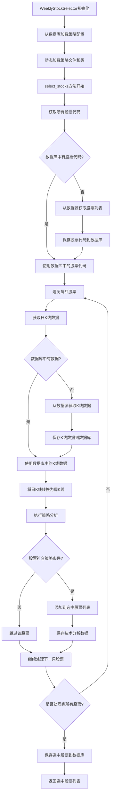
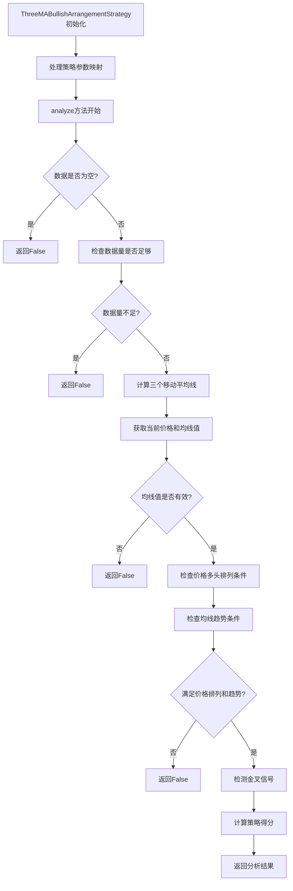
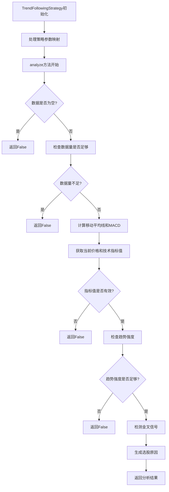

# Weekly Selector和Three MA Bullish Arrangement策略分析文档

## 概述

本文档详细分析了Quant MAS系统中Weekly Selector Agent和Three MA Bullish Arrangement Strategy的运行逻辑、流程以及各函数的功能。

## Weekly Selector Agent 运行流程

Weekly Selector采用动态策略加载机制：
1. 初始化时从数据库加载策略配置
2. 动态导入策略文件并实例化策略类
3. 遍历所有股票，获取K线数据并转换为周线
4. 执行策略分析并筛选符合条件的股票
5. 将结果保存到数据库供后续使用



### Weekly Selector 主要函数功能总结

1. **`__init__`**: 初始化Weekly Selector框架，加载数据库管理器、数据获取器和策略配置

2. **`_load_strategy_from_db`**: 从数据库加载策略配置，包括策略名称、参数、文件名和类名

3. **`_load_dynamic_strategy`**: 动态导入策略模块并实例化策略类

4. **`select_stocks`**: 核心选股方法，处理所有股票并筛选符合策略条件的股票
   - 获取所有股票代码
   - 遍历每只股票获取K线数据
   - 执行策略分析
   - 返回选中股票列表及相关信息

5. **`_execute_strategy`**: 执行具体的策略分析，调用策略实例的analyze方法

6. **`_convert_daily_to_weekly`**: 将日K线数据转换为周K线数据

7. **`save_selected_stocks`**: 将选中的股票保存到数据库的池中

## Three MA Bullish Arrangement Strategy 运行流程

该策略基于三均线多头排列原理：
1. 计算三个移动平均线（默认5日、13日、34日）
2. 检查价格是否满足多头排列（价格>MA5>MA13>MA34）
3. 确认均线都处于上升趋势
4. 检测金叉信号（MA5上穿MA13）
5. 计算策略得分用于股票排序



### Three MA Bullish Arrangement Strategy 主要函数功能总结

1. **`__init__`**: 初始化策略，处理参数映射（数据库参数名到策略参数名的转换）

2. **`analyze`**: 核心分析方法，判断股票是否符合三均线多头排列策略
   - 检查数据有效性
   - 计算三个移动平均线（默认5日、13日、34日）
   - 检查价格是否满足多头排列（价格>MA5>MA13>MA34）
   - 检查均线是否都处于上升趋势
   - 检测金叉信号（MA5上穿MA13）
   - 计算策略得分
   - 返回分析结果

3. **`_detect_golden_cross_with_params`**: 检测金叉信号，判断短均线是否上穿中均线

4. **`execute`**: 执行策略方法，处理多个股票的数据并保存结果到数据库

5. **`generate_signals`**: 生成交易信号，基于均线金叉生成买入信号

6. **`calculate_position_size`**: 计算仓位大小，根据信号和投资组合价值确定持仓量

### Three MA Bullish Arrangement Strategy 返回值说明

`analyze`方法返回一个四元组(Tuple)，具体为：

```python
Tuple[bool, str, Optional[float], bool]
```

#### 返回值各元素说明

1. **第一个元素 (bool)**: `meets_criteria` - 是否满足选股条件
   - `True`表示股票符合三均线多头排列策略的选股条件
   - `False`表示不符合条件

2. **第二个元素 (str)**: `selection_reason` - 选股原因/描述
   - 当满足条件时，返回类似"满足多头排列: 收盘价=XX.XX, MA5=XX.XX, MA13=XX.XX, MA34=XX.XX"的描述
   - 当不满足条件时，返回具体原因，如"不满足条件: 价格未形成多头排列..."或"数据不足，需要XX条数据"

3. **第三个元素 (Optional[float])**: `score` - 策略得分
   - 类型为可选的浮点数
   - 得分范围在0-100之间
   - 计算公式：`max(0, min(100, 50 * (ma_short - ma_mid) / ma_mid + 30 * (ma_mid - ma_long) / ma_long + 20 * (price - ma_short) / ma_short))`

4. **第四个元素 (bool)**: `golden_cross_detected` - 是否检测到金叉信号
   - `True`表示检测到MA5上穿MA13的金叉信号
   - `False`表示未检测到金叉信号

#### 代码中的具体返回语句

在满足条件的情况下：
```python
return True, reason, score, golden_cross_condition
```

在不满足条件的情况下：
```python
return False, reason, None, False
```

在出现异常的情况下：
```python
return False, f"分析错误: {e}", None, False
```

## Trend Following Strategy 运行流程

该策略基于趋势跟踪原理：
1. 计算快慢两个移动平均线（默认5日、13日）
2. 计算MACD指标（默认12,26,9周期）
3. 检查价格是否创近期新高（默认5周期）
4. 综合评估趋势强度并打分
5. 检测金叉信号（MA5上穿MA13且DIF上穿DEA）



### Trend Following Strategy 主要函数功能总结

1. **`__init__`**: 初始化策略，处理参数映射（数据库参数名到策略参数名的转换）

2. **`analyze`**: 核心分析方法，判断股票是否符合趋势跟踪策略
   - 检查数据有效性
   - 计算快慢移动平均线和MACD指标
   - 检查价格是否创近期新高
   - 综合评估趋势强度并打分
   - 检测金叉信号
   - 返回分析结果

3. **`get_technical_analysis_data`**: 获取技术分析数据，供Weekly Selector格式化使用
   - 计算移动平均线和MACD指标
   - 返回包含价格、均线和MACD值的字典

4. **`_calculate_score`**: 计算趋势强度得分
   - 均线排列强度（40%权重）
   - MACD动量（30%权重）
   - 零轴之上加分（20%权重）
   - 突破强度（10%权重）

5. **`_detect_golden_cross`**: 检测金叉信号
   - 检查快均线是否上穿慢均线
   - 检查DIF是否上穿DEA

6. **`execute`**: 执行策略方法，处理多个股票的数据并保存结果到数据库

7. **`generate_signals`**: 生成交易信号，基于趋势条件生成买入信号

8. **`calculate_position_size`**: 计算仓位大小，根据信号和投资组合价值确定持仓量

### Trend Following Strategy 返回值说明

`analyze`方法返回一个四元组(Tuple)，具体为：

```python
Tuple[bool, str, Optional[float], bool]
```

#### 返回值各元素说明

1. **第一个元素 (bool)**: `meets_criteria` - 是否满足选股条件
   - `True`表示股票符合趋势跟踪策略的选股条件
   - `False`表示不符合条件

2. **第二个元素 (str)**: `selection_reason` - 选股原因/描述
   - 当满足条件时，返回类似"满足趋势跟踪条件: 收盘价=XX.XX, MA5=XX.XX, MA13=XX.XX, DIF=XX.XX, DEA=XX.XX"的描述
   - 当不满足条件时，返回具体原因，如"趋势强度不足，得分=XX.XX"或"数据不足，需要XX条数据"

3. **第三个元素 (Optional[float])**: `score` - 策略得分
   - 类型为可选的浮点数
   - 得分范围在0-100之间
   - 计算公式：
     ```
     score = max(
         0,
         min(
             100,
             40 * (ma_fast - ma_slow) / ma_slow  # 均线排列强度
           + 30 * (macd_dif - macd_dea) / abs(macd_dea) if macd_dea != 0 else 0  # MACD动量
           + 20 * max(0, (macd_dif - 0)) / max(0.01, macd_dif)  # 零轴之上加分
           + 10 * (price - historical_high) / historical_high  # 突破强度
         )
     )
     ```

4. **第四个元素 (bool)**: `golden_cross_detected` - 是否检测到金叉信号
   - `True`表示检测到金叉信号（快均线>慢均线且DIF>DEA）
   - `False`表示未检测到金叉信号

#### 代码中的具体返回语句

在满足条件的情况下：
```python
return True, reason, score, golden_cross_condition
```

在不满足条件的情况下：
```python
return False, reason, score, False
```

在出现异常的情况下：
```python
return False, f"分析错误: {e}", None, False
```

## 数据库存储机制

### 核心存储方法

```python
def save_selected_stocks_to_pool(self, strategy_key: str, agent_name: str, strategy_id: str,
                               strategy_name: str, stocks: List[Dict], date: str,
                               last_data_date: Optional[str] = None,
                               strategy_params: Optional[Dict] = None) -> bool:
```

### 存储逻辑分析

1. **主键生成**:
   - 使用`last_data_date`或`date`计算ISO年周数作为主键
   - 格式为`{year}-{week:02d}`

2. **数据准备**:
   - 转换NumPy类型为Python原生类型确保MongoDB兼容性
   - 获取策略参数（如果未提供则从数据库获取）

3. **数据结构**:
   ```python
   record = {
       '_id': year_week_key,  // 使用年-周作为主键
       'strategy_key': strategy_key,
       'strategy_name': strategy_name,
       'strategy_parameters': strategy_parameters,
       'stocks': stocks_data,
       'count': len(stocks),
       'created_at': datetime.now(),
       'updated_at': datetime.now()
   }
   ```

4. **存储操作**:
   - 使用`replace_one`方法进行upsert操作
   - 如果记录存在则更新，不存在则插入

### Weekly Selector调用点

在Weekly Selector中，这个方法通过以下方式调用：

```python
// 在save_selected_stocks方法中
return db_ops.save_selected_stocks_to_pool(
    strategy_key=strategy_key,
    agent_name="WeeklySelector",
    strategy_id=strategy_id,
    strategy_name=strategy_name,
    stocks=stocks_data,
    date=date,
    last_data_date=last_data_date,
    strategy_params=self.strategy_params
)
```

其中`stocks_data`是格式化后的股票数据列表，每个元素包含：
- `code`: 股票代码
- `score`: 策略得分
- `golden_cross`: 金叉标志
- `value`: 技术分析数据文本

## Technical Analysis Data 生成机制

### 数据生成流程

#### 1. 策略分析阶段
在策略的`analyze`方法中，计算技术指标：
- 价格数据：`current_price = close_prices[-1]`
- 快速均线：`ma_fast_last`
- 慢速均线：`ma_slow_last`
- MACD指标：`macd_dif_last`, `macd_dea_last`

但`analyze`方法只返回四元组：`(meets_criteria, reason, score, golden_cross_condition)`

#### 2. Weekly Selector处理阶段
在`WeeklyStockSelector._execute_strategy`方法中：

1. **调用策略分析**：
   ```python
   result = self.strategy_instance.analyze(k_data)
   ```

2. **尝试获取技术分析数据**：
   ```python
   // 检查策略返回值是否包含技术分析数据（大多数策略不包含）
   if isinstance(result, tuple) and len(result) > 4:
       strategy_tech_data = result[4] if len(result) > 4 else {}

   // 尝试从策略实例获取技术分析数据
   if not technical_analysis_data and hasattr(self.strategy_instance, 'get_technical_analysis_data'):
       technical_analysis_data = self.strategy_instance.get_technical_analysis_data(k_data)

   // 备用方法：直接计算技术指标
   if not technical_analysis_data:
       if hasattr(self.strategy_instance, 'params'):
           params = self.strategy_instance.params
           short_period = params.get('short', 5)
           mid_period = params.get('mid', 13)
           long_period = params.get('long', 34)

           // 计算移动平均线
           if len(k_data) >= max(short_period, mid_period, long_period):
               import numpy as np
               close_prices = np.array(k_data['close'].values, dtype=np.float64)

               // 计算移动平均线
               if len(close_prices) >= short_period:
                   ma_short = np.mean(close_prices[-short_period:])
                   technical_analysis_data['ma_short'] = float(ma_short)

               if len(close_prices) >= mid_period:
                   ma_mid = np.mean(close_prices[-mid_period:])
                   technical_analysis_data['ma_mid'] = float(ma_mid)

               if len(close_prices) >= long_period:
                   ma_long = np.mean(close_prices[-long_period:])
                   technical_analysis_data['ma_long'] = float(ma_long)

               // 添加当前价格
               if len(close_prices) > 0:
                   technical_analysis_data['price'] = float(close_prices[-1])
   ```

#### 3. 最终数据结构
`technical_analysis_data`字典包含：
- `price`: 当前收盘价
- `moving_averages`: 移动平均线字典
  - `sma_5`: 5日均线值
  - `sma_13`: 13日均线值
- `macd`: MACD指标字典
  - `dif`: DIF值
  - `dea`: DEA值

#### 4. 格式化为value字段
在`save_selected_stocks`方法中，使用`StrategyResultFormatter.format_value_field`将技术分析数据格式化为字符串：

对于Three MA策略：
```python
"收盘价=XX.XX, MA5=XX.XX, MA13=XX.XX, MA34=XX.XX"
```

对于Trend Following策略：
```python
"收盘价=XX.XX, MA5=XX.XX, MA13=XX.XX, DIF=XX.XX, DEA=XX.XX"
```

## 核心逻辑说明

### Weekly Selector 工作原理：
1. **策略加载**: Weekly Selector采用动态加载机制，从数据库读取策略配置，然后动态导入对应的策略文件并实例化策略类
2. **数据处理**: 为每只股票获取一年的日K线数据，转换为周K线后交给策略分析
3. **策略执行**: 调用具体策略的analyze方法进行分析，根据返回结果判断是否符合选股条件
4. **结果保存**: 将符合条件的股票保存到数据库的池中，供后续交易使用

### Three MA Bullish Arrangement Strategy 工作原理：
1. **多头排列判断**: 检查收盘价是否大于MA5，MA5是否大于MA13，MA13是否大于MA34
2. **趋势确认**: 确认三个均线都处于上升趋势状态
3. **金叉检测**: 检测MA5是否刚刚上穿MA13形成金叉
4. **得分计算**: 根据均线之间的距离计算策略得分，用于排序选中的股票

### Trend Following Strategy 工作原理：
1. **趋势判断**: 检查快均线是否大于慢均线，DIF是否大于DEA
2. **动量确认**: 通过MACD指标确认趋势动量
3. **突破检测**: 检查价格是否创近期新高
4. **综合评分**: 根据多个维度综合评估趋势强度并打分
5. **金叉检测**: 检测均线和MACD的金叉信号

这套系统实现了灵活的策略框架，Weekly Selector作为调度器负责数据获取和结果管理，而具体的选股策略则通过策略类实现，便于扩展和维护。

